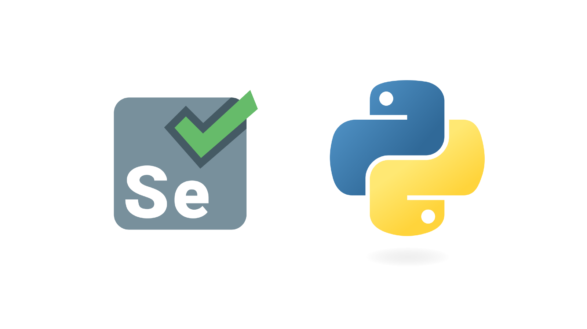

<h1 align="center"><strong>UI Selenium Automation Project</strong></h1>
 
## **Automated tests to verify the functionality of an urban transportation app called Urban Routes**

- Definition of locators and methods used in the `UrbanRoutesPage` class  
- Definition of test cases in the `TestUrbanRoutes` class  
- Automated tests covering the complete taxi booking workflow:
  - Setting a pickup address  
  - Selecting a fare option  
  - Filling in a valid phone number  
  - Adding a valid credit card  
  - Writing a message for the driver  
  - Requesting additional services  
  - Ordering a taxi by clicking the corresponding button  
  - Waiting for the driver’s information, license plate, and estimated arrival time to appear in the modal

# **Python and Pytest Verification & Installation**
 

This file outlines the steps to verify whether Python is installed in your development environment, how to install it if missing, and how to check for pytest installation and run tests using pytest.

## **Verifying Python Installation on Windows**

To check if Python is installed, open a Git Bash terminal and run the following command:

```bash
python --version
```

If that doesn't work, try:

```bash
python3 --version
```

If you don’t have Git Bash installed, you can download it for Windows from [here](https://git-scm.com/download/win).  
On macOS, Git Bash is not required because a default terminal (zsh) is already available, but you can still download Git from [here](https://git-scm.com/downloads).

If Python is installed, this command will display the installed version. If not, you’ll see an error indicating that `'python'` is not recognized as a command.

### **Installing Python**

If Python is not installed, follow these steps based on your operating system:

**:**

- Go to the official Python website: [https://www.python.org/downloads/windows/](https://www.python.org/downloads/windows/)  
- Download the appropriate installer for your system  
- Run the installer and follow the on-screen instructions

**:**

You can install Python using Homebrew from the terminal:

```bash
brew install python
```

or, if that fails:

```bash
brew install python3
```

Alternatively, download the installer from the official Python website: [https://www.python.org/downloads/](https://www.python.org/downloads/)

**:**

Most Linux distributions include Python by default. You can install or update it using your distribution’s package manager. For example, on Ubuntu or Debian, run:

```bash
sudo apt-get update
sudo apt-get install python3
```

## **Verifying Pytest Installation**

To check if pytest is installed, run the following command in your terminal:

```bash
pytest --version
```

If pytest is installed, it will display the version number. If not, you’ll get an error indicating that `'pytest'` is not recognized.

If pytest is not installed, you can install it using `pip`, Python’s package manager:

```bash
pip install -U pytest
```

## **Running Tests with Pytest**

Once pytest is installed, you can run your tests as follows:

- In your terminal, navigate to the directory containing your test files  
- Run the command:

```bash
pytest
```

This will execute all tests in the current directory and its subdirectories.

> **Note:** This is a general guide. Steps may vary slightly depending on your operating system and specific environment configuration.

This should provide a clear, step-by-step reference for verifying Python, installing it if needed, checking for pytest, and running automated tests once everything is set up.